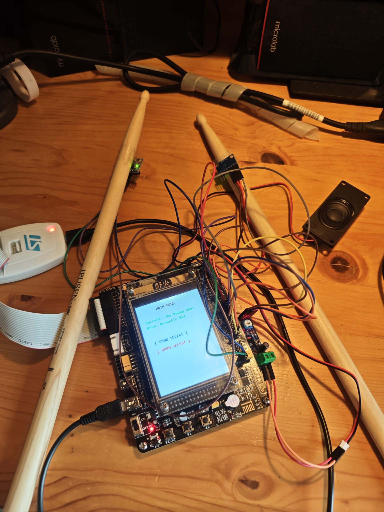

# STM32 Air Drumsticks

An embedded, motion-tracking virtual air drum kit developed for the **STM32F103VET6** microcontroller platform. By tracking real-time motion data from dual inertial measurement units (IMUs), the system processes acceleration and angular velocity to detect striking gestures, dynamically triggering drum samples stored on a file system.

## 🚀 Features

- **Dual-Sensor Motion Tracking:** Independent tracking for a two-drumstick setup using two MPU6050 6-axis IMUs.
- **Robust Strike Detection Algorithm:** Implements data filtering and thresholding—specifically targeting $x$-axis acceleration dynamics—to accurately register hits while eliminating false positives and double-triggering.
- **Onboard File System:** Integrated **FatFs** configuration to handle audio sample management, configuration storage, or track recording directly from physical media (e.g., SD Card via SPI/SDIO).
- **Hardware-Level I2C Optimization:** Efficient handling of multi-device I2C communication, register offsets, and addressing for dual-sensor polling on shared or independent buses.
- **Modular Codebase:** Clean separation between core MCU initialization (`Core`, `Drivers`) and higher-level execution logic (`Drum`, `FATFS`).

## 🛠️ Hardware Requirements

- **MCU Board:** STM32F103VET6 development board
- **Sensors:** 2 × MPU6050 6-Axis Gyroscope & Accelerometer modules
- **Storage/Audio Interface:** SD Card slot (configured for FatFs) and an audio output mechanism (DAC/PWM with an amplifier/buzzer)
- **Connections:** Standard I2C for the IMUs, SPI/SDIO for the SD card reader, and GPIOs for basic indicators

## 📷 Hardware Setup



## 📁 Repository Structure

```text
├── .settings/               # IDE-specific project settings
├── Core/                    # Core source code (main.c, interrupt handlers, system initialization)
│   ├── Inc/                 # Core header files
│   └── Src/                 # Core source implementation
├── Drivers/                 # STM32 HAL and CMSIS driver files
├── Drum/                    # Custom application logic for air drumstick processing
│   ├── Inc/                 # Motion filtering and drum state machine headers
│   └── Src/                 # MPU6050 drivers, filtering algorithms, and hit detection
├── FATFS/                   # FatFs middleware file-handling implementation
├── Middlewares/Third_Party/ # Third-party libraries (FatFs file system components)
├── STM32-Air-Drumsticks.ioc # STM32CubeMX Configuration Project file
└── STM32F103VETX_FLASH.ld  # Linker script for the STM32F103VETX microcontroller
